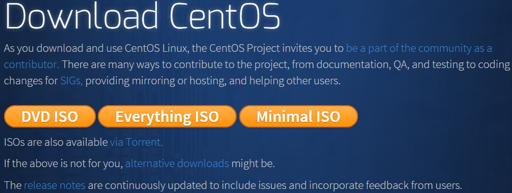
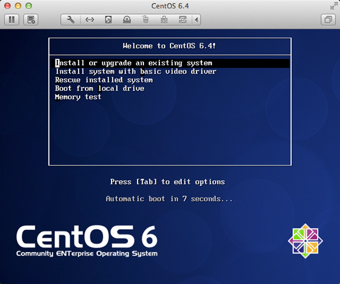

# Linux 安装

- linux官网地址地址
    https://www.centos.org/download/
- 旧版下载地址
    https://wiki.centos.org/Download

- **CentOS-7.0-x86_64-DVD-1503-01.iso **: 标准安装版，一般下载这个就可以了（推荐）
- **CentOS-7.0-x86_64-NetInstall-1503-01.iso **: 网络安装镜像（从网络安装或者救援系统）
- **CentOS-7.0-x86_64-Everything-1503-01.iso**: 对完整版安装盘的软件进行补充，集成所有软件。（包含centos7的一套完整的软件包，可以用来安装系统或者填充本地镜像）
- **CentOS-7.0-x86_64-GnomeLive-1503-01.iso**: GNOME桌面版
- **CentOS-7.0-x86_64-KdeLive-1503-01.iso**: KDE桌面版
- **CentOS-7.0-x86_64-livecd-1503-01.iso **: 光盘上运行的系统，类拟于winpe
- **CentOS-7.0-x86_64-minimal-1503-01.iso **: 精简版，自带的软件最少

Linux 安装步骤
1、首先，使用光驱或U盘或你下载的Linux ISO文件进行安装。

界面说明：

Install or upgrade an existing system 安装或升级现有的系统

install system with basic video driver 安装过程中采用基本的显卡驱动

Rescue installed system 进入系统修复模式

Boot from local drive   退出安装从硬盘启动

Memory test  内存检测

