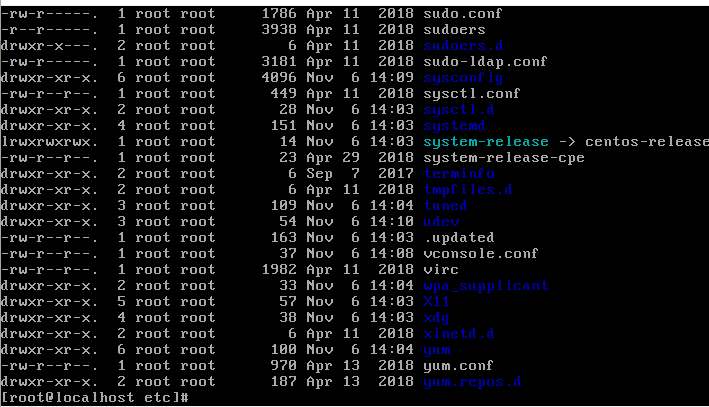
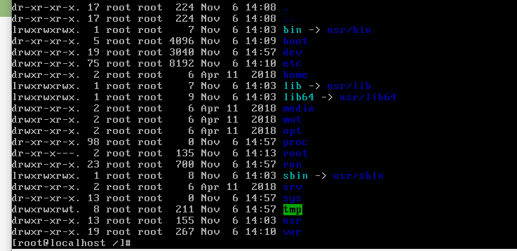
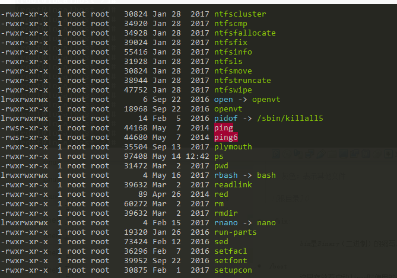
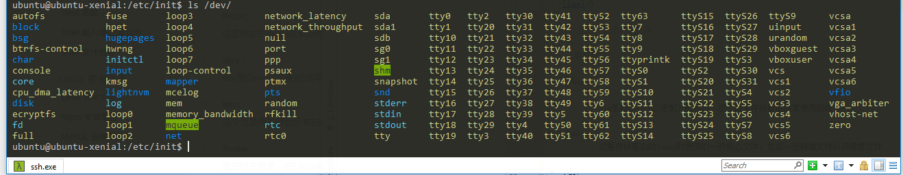

Linux 根目录（/）下一般有 以下这些文件夹
   
   Linux下各种颜色代表的文件
   
       白色：表示普通文件
  
       
       蓝色：表示目录
  
       
       绿色：表示可执行文件
  
       
       红色：表示压缩文件
       
       浅蓝色：链接文件
 
       
       红色闪烁：表示链接的文件有问题
       
       黄色：表示设备文件
  
       
       灰色：表示其他文件    
   
    
        
*  /bin:  常用命令目录
      
            bin是Binary（二进制）的缩写, 这个目录存放着最经常使用的命令。

*  /boot  核心文件目录
            
            这里存放着启动linux时使用的一些核心文件，包括一些链接文件以及镜像文件
         
*  /dev  外部设备目录
            
            dev是Device(设备)的缩写，该目录下存放的是linux的外部设备，在linux中访问设备的方式和访问文件的方式是一样的
            
*  /etc    配置目录
            
            这个目录是用来存放所有的系统管理所需要的配置文件和子目录
         
*  /home  用户目录

            用户的主目录，在linux中，每个用户都有一个自己的目录,一般该目录名是以用户的账户命名的
         
*  /lib   系统基础dll目录
            
            这个目录是存放着系统最基本的动态连接共享库，其作用类似windows里的dll文件。几乎所有的应用程序都需要用到这些共享库。
            
* /lost+found  非法关机log记录目录
            
            这个目录一般情况下是空的，当系统非法关机后，这里存放一些文件。
            
* /media   自动识别设备挂载目录
            
            linux系统会自动识别一些设备，例如U盘、光驱等等，当识别后linux系统会把识别的设备挂载到这个目录下
            
* /mnt     临时设备挂载目录
            
            系统提供该目录是为了让用户临时挂载别的文件系统的，我们可以将光驱挂载到/mnt 上，然后进入该目录查看光驱里面的内容
            
* /opt    第三方软件安装目录
            
            这里是给主机额外安装软件所摆放的目录
            
* /proc     内存映射目录
            
            这个目录是一个虚拟的目录，它是系统内存的映射，我们可以通过直接访问这个目录来获取系统信息。这个目录的内容不在硬盘上而是在内存里，我们可以直接修改这里的文件，比如可以通过以下命令来屏蔽筑基的ping 命令，使别人无法ping你的机器
            echo 1 > /proc/sys/net/ipv4/icmp_echo_ignore_all
            
* /root     管理员目录
            
            该目录为系统管理员，也称超级权限者的用户主目录
          
* /sbin     管理员命令目录
            
            s是super user的意思 ，这里存放的是系统管理员使用的系统管理程序
          
* /selinux  centos特有的安全防护软件的文件目录
            
            这个目录是Redhat/centos 所特有的目录，selinux是一个安全机制，类似于windows的防火墙，但是这套机制比较复杂，这个目录就是存放selinux相关文件的

* /srv    启动服务需要拉取的数据的存放目录
            
            该目录存放一些服务启动之后需要提取的数据
            
* /sys      存放进程，设备，伪终端文件
            
            这是linux2.6内核的一个很大的变化。该目录下安装了2.6内核中新出现的一个文件系统 sysfs 。
            
            sysfs文件系统集成了下面3种文件系统的信息：针对进程信息的proc文件系统、针对设备的devfs文件系统以及针对伪终端的devpts文件系统。
            该文件系统是内核设备树的一个直观反映。
            
            当一个内核对象被创建的时候，对应的文件和目录也在内核对象子系统中被创建。
            
* /tmp      临时文件                                   
            
            这个目录是用来存放一些临时文件的
            
* /usr      用户的程序目录
            
            这是一个非常重要的目录，用户的很多应用程序和文件都存放在这个目录下，类似于windows下的program files目录
          
* /usr/bin  系统用户的程序目录
            
            系统用户使用的应用程序
            
* /usr/sbin  超级用户的管理程序目录
            
            超级用户使用的比较高级的管理程序和系统守护程序
            
* /var  存放日志的文件
        
            这里目录中存放着不断被扩种的东西，我们习惯的将那些被修改的目录放在这个目录下，包括各种日志文件
            
* /run   运行记录文件
            
            是一个临时文件系统，存储系统启动以来的信息。当系统重启时 这个目录下的文件应该被删除或清除，如果你的系统上有/var/run 目录，应该让他指向run
            
     #注意
            
            在 Linux 系统中，有几个目录是比较重要的，平时需要注意不要误删除或者随意更改内部文件。
            
            /etc： 上边也提到了，这个是系统中的配置文件，如果你更改了该目录下的某个文件可能会导致系统不能启动。
            
            /bin, /sbin, /usr/bin, /usr/sbin: 这是系统预设的执行文件的放置目录，比如 ls 就是在/bin/ls 目录下的。
            
            值得提出的是，/bin, /usr/bin 是给系统用户使用的指令（除root外的通用户），而/sbin, /usr/sbin 则是给root使用的指令。
            
            /var： 这是一个非常重要的目录，系统上跑了很多程序，那么每个程序都会有相应的日志产生，而这些日志就被记录到这个目录下，具体在/var/log 目录下，另外mail的预设放置也是在这里。                                                                     
                         
            
            
               
            
            