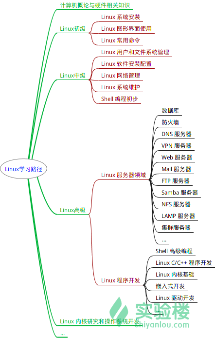
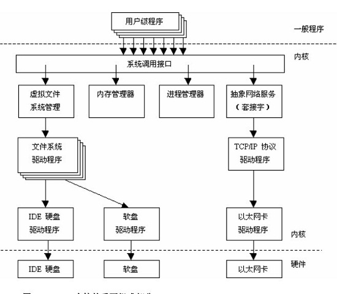

# Linux 层级划分

#Linux系统一般有4个主要部分：

内核、shell、文件系统和应用程序。
内核、shell和文件系统一起形成了基本的操作系统结构，它们使得用户可以运行程序、管理文件并使用系统。部分层次结构如图1-1所示。

* 内核
    
         内核是操作系统的核心，具有很多最基本功能，它负责管理系统的进程、内存、设备驱动程序、文件和网络系统，决定着系统的性能和稳定性。
    
           Linux 内核由如下几部分组成：内存管理、进程管理、设备驱动程序、文件系统和网络管理等。如图：

 * shell
 
         
    通常在图形界面中对实际体验带来差异的不是上述的不同发行版的各种终端模拟器，而是这个 Shell（壳）。有壳就有核，这里的核就是指 UNIX/Linux 内核，Shell 是指“提供给使用者使用界面”的软件（命令解析器），类似于 DOS 下的 command（命令行）和后来的 cmd.exe 。普通意义上的 Shell 就是可以接受用户输入命令的程序。它之所以被称作 Shell 是因为它隐藏了操作系统底层的细节。同样的 UNIX/Linux 下的图形用户界面 GNOME 和 KDE，有时也被叫做“虚拟 shell”或“图形 shell”。
 
 
    shell是系统的用户界面，提供了用户与内核进行交互操作的一种接口。它接收用户输入的命令并把它送入内核去执行，是一个命令解释器。另外，shell编程语言具有普通编程语言的很多特点，用这种编程语言编写的shell程序与其他应用程序具有同样的效果。
    目前主要有下列版本的shell。
    
    - 1．Bourne Shell：是贝尔实验室开发的。 　
    - 2．BASH：是GNU的Bourne Again Shell，是GNU操作系统上默认的shell,大部分linux的发行套件使用的都是这种shell。
    - 3．Korn Shell：是对Bourne SHell的发展，在大部分内容上与Bourne Shell兼容。 　　　
    - 4．C Shell：是SUN公司Shell的BSD版本。
    
* linux 文件系统
    
    - Linux下面的文件类型主要有：
    
        1) 普通文件：C语言元代码、SHELL脚本、二进制的可执行文件等。分为纯文本和二进制。
        2) 目录文件：目录，存储文件的唯一地方。
        3) 链接文件：指向同一个文件或目录的的文件。
        4) 设备文件：与系统外设相关的，通常在/dev下面。分为块设备和字符设备。
        5) 管道(FIFO)文件 :  提供进程建通信的一种方式
        6) 套接字(socket) 文件： 该文件类型与网络通信有关
     
     - Linux目录 
        
              　/bin 二进制可执行命令
              
            　　/dev 设备特殊文件
            
            　　/etc 系统管理和配置文件
            
            　　/etc/rc.d 启动的配置文件和脚本
            
            　　/home 用户主目录的基点，比如用户user的主目录就是/home/user，可以用~user表示
            
            　　/lib 标准程序设计库，又叫动态链接共享库，作用类似windows里的.dll文件
            
            　　/sbin 系统管理命令，这里存放的是系统管理员使用的管理程序
            
            　　/tmp 公用的临时文件存储点
            
            　　/root 系统管理员的主目录（呵呵，特权阶级）
            
            　　/mnt 系统提供这个目录是让用户临时挂载其他的文件系统。
            
            　　/lost+found 这个目录平时是空的，系统非正常关机而留下“无家可归”的文件（windows下叫什么.chk）就在这里
            
            　　/proc 虚拟的目录，是系统内存的映射。可直接访问这个目录来获取系统信息。
            
            　　/var 某些大文件的溢出区，比方说各种服务的日志文件
            
            　　/usr 最庞大的目录，要用到的应用程序和文件几乎都在这个目录。其中包含：
            
            　　      /usr/X11R6 存放X window的目录
            
            　　      /usr/bin 众多的应用程序
            
            　　      /usr/sbin 超级用户的一些管理程序
            
            　　      /usr/doc linux文档
            
            　　      /usr/include linux下开发和编译应用程序所需要的头文件
            
            　　      /usr/lib 常用的动态链接库和软件包的配置文件
            
            　　      /usr/man 帮助文档
            
            　　      /usr/src 源代码，linux内核的源代码就放在/usr/src/linux里
            
            　　      /usr/local/bin 本地增加的命令
            
            　　      /usr/local/lib 本地增加的库
            
        * 软连接和硬连接
        
        　- 硬连接：
                
                  是给文件一个副本，原文件名和连接文件名都指向相同的物理地址。目录不能有硬连接；硬连接不能跨越文件系统（不能跨越不同的分区）文件在磁盘中只有一个拷贝，节省硬盘空间；
        
                  修改其中一个，与其连接的文件同时被修改。如果删除其中任意一个其余的文件将不受影响。
       
                  由于删除文件要在同一个索引节点属于唯一的连接时才能成功，因此可以防止不必要的误删除。
        　　
          - 符号连接（软连接）：
                
                    
                    用ln -s命令建立文件的符号连接符号连接是linux特殊文件的一种，作为一个文件，它的数据是它所连接的文件的路径名。类似windows下的快捷方式。
            　　    
                    当然删除这个连接，也不会影响到源文件，但对连接文件的使用、引用都是直接调用源文件的。
                    
                    
   *           按键	作用
               Tab      补全
               Ctrl+d	键盘输入结束或退出终端
               Ctrl+s	暂停当前程序，暂停后按下任意键恢复运行
               Ctrl+z	将当前程序放到后台运行，恢复到前台为命令fg
               Ctrl+a	将光标移至输入行头，相当于Home键
               Ctrl+e	将光标移至输入行末，相当于End键
               Ctrl+k	删除从光标所在位置到行末
               Alt+Backspace	向前删除一个单词
               Shift+PgUp	将终端显示向上滚动
               Shift+PgDn	将终端显示向下滚动
               
   *    历史命令       
          
          
               你可以使用键盘上的方向上键↑，恢复你之前输入过的命令，你一试便知。
    
   *    通配符
                
                字符	含义
                *	匹配 0 或多个字符
                ?	匹配任意一个字符
                [list]	匹配 list 中的任意单一字符
                [^list]	匹配 除list 中的任意单一字符以外的字符
                [c1-c2]	匹配 c1-c2 中的任意单一字符 如：[0-9] [a-z]
                {string1,string2,...}	匹配 string1 或 string2 (或更多)其一字符串
                {c1..c2}	匹配 c1-c2 中全部字符 如{1..10}
                
            
    
    
   *   man
   
        Manual pages 是 UNIX 或类 UNIX 操作系统中在线软件文档的一种普遍的形式， 内容包括计算机程序（包括库和系统调用）、正式的标准和惯例，甚至是抽象的概念。用户可以通过执行man命令调用手册页。
        
       通常情况下，man 手册里面的内容都是英文的，这就要求你有一定的英文基础。man 手册的内容很多，涉及了 Linux 使用过程中的方方面面。为了便于查找，man 手册被进行了分册（分区段）处理，在 Research UNIX、BSD、OS X 和 Linux 中，手册通常被分为8个区段，安排如下：
        
        区段	说明
        1	一般命令
        2	系统调用
        3	库函数，涵盖了C标准函数库
        4	特殊文件（通常是/dev中的设备）和驱动程序
        5	文件格式和约定
        6	游戏和屏保
        7	杂项
        8	系统管理命令和守护进程
        要查看相应区段的内容，就在 man 后面加上相应区段的数字即可，如：
        
        
     