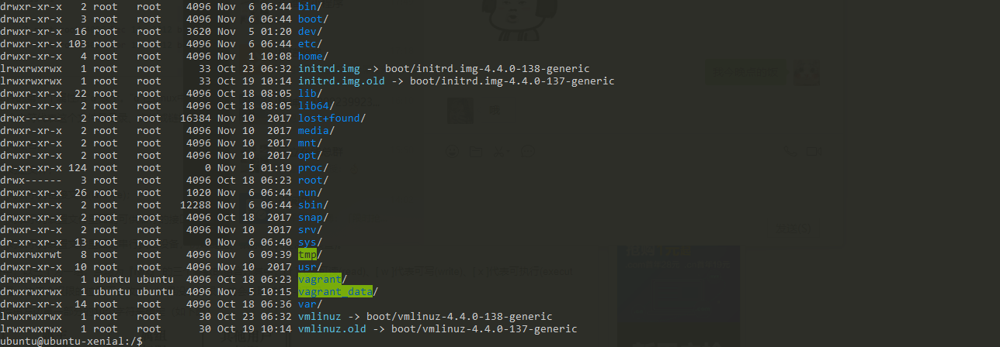
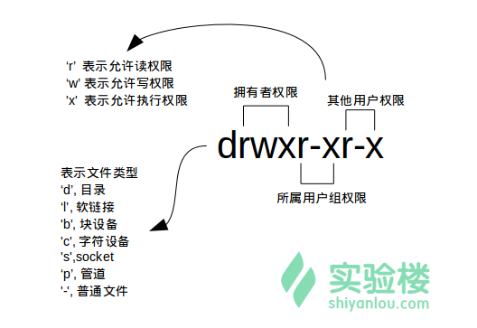

#文件权限
   
   
   * 在linux中文件的第一个字符表示的是文件类型
        
            d 表示目录
            - 表示文件
            l 表示链接文件
            b 块设备比如硬盘 表示为装置文件里面的可供存储的接口设备（可随机存取的装置）
            c 字符设备 比如光盘 表示为装置文件里面的的串行端口设备，列如键盘、鼠标（一次性读取装置）
            s socket
            p 管道
          
            
         
   
            
            从左至右用0-9这些数字来表示。
            
            第0位确定文件类型，第1-3位确定属主（该文件的所有者）拥有该文件的权限。
            
            第4-6位确定属组（所有者的同组用户）拥有该文件的权限，第7-9位确定其他用户拥有该文件的权限。
            其中，第1、4、7位表示读权限，如果用"r"字符表示，则有读权限，如果用"-"字符表示，则没有读权限；
            
            第2、5、8位表示写权限，如果用"w"字符表示，则有写权限，如果用"-"字符表示没有写权限；第3、6、9位表示可执行权限，如果用"x"字符表示，则有执行权限，如果用"-"字符表示，则没有执行权限。
            
            对于文件来说，它都有一个特定的所有者，也就是对该文件具有所有权的用户。
            
            同时，在Linux系统中，用户是按组分类的，一个用户属于一个或多个组。
            
            文件所有者以外的用户又可以分为文件所有者的同组用户和其他用户。
            
            因此，Linux系统按文件所有者、文件所有者同组用户和其他用户来规定了不同的文件访问权限。
            
            在以上实例中，mysql 文件是一个目录文件，属主和属组都为 mysql，属主有可读、可写、可执行的权限；与属主同组的其他用户有可读和可执行的权限；其他用户也有可读和可执行的权限。
            
            对于 root 用户来说，一般情况下，文件的权限对其不起作用。
            
 * chgrp  更改文件属性
    
        chgrap [-R] 属组名 文件名     
         
     *  -R 递归更改文件属组，就是在更改某个目录文件的属组时，如果加上-R的参数，那么该目录下的所有文件的属组都会更改。
      
      例子：
            
            chgrp -R users a/
      
  * chown 更改文件属主，也可以同时更改文件属组
        
            chown [-R] 属主名 文件名
        
            chown [-R] 属主名：属组名 文件名
        
       例子： 
            
            chown -R www-data a/  更改文件夹属主
             
            sudo chown -R root:root a/ 更改文件夹属主：属组
                
  * chmod  更改文件9个属性
        
            linux文件属性有两种设置方法，一种是数字，一种是符号。
            
            inux文件的基本权限就有九个，分别是owner/group/others三种身份各有自己的read/write/execute权限。
            
            先复习一下刚刚上面提到的数据：文件的权限字符为：『-rwxrwxrwx』， 这九个权限是三个三个一组的！其中，我们可以使用数字来代表各个权限，各权限的分数对照表如下：
            
            r:4
            w:2
            x:1
            
            每种身份(owner/group/others)各自的三个权限(r/w/x)分数是需要累加的，例如当权限为： [-rwxrwx---] 分数则是：
            
            owner = rwx = 4+2+1 = 7
            group = rwx = 4+2+1 = 7
            others= --- = 0+0+0 = 0
        
       * chmod [-R] xyz 文件或目录
       
                选项与参数：
                xyz : 就是刚刚提到的数字类型的权限属性，为 rwx 属性数值的相加。
                -R : 进行递归(recursive)的持续变更，亦即连同次目录下的所有文件都会变更
                
                还有一个改变权限的方法呦！从之前的介绍中我们可以发现，基本上就九个权限分别是(1)user (2)group (3)others三种身份啦！ 那么我们就可以藉由u, g, o来代表三种身份的权限！
                
                此外， a 则代表 all 亦即全部的身份！那么读写的权限就可以写成r, w, x！也就是可以使用底下的方式来看：
                
       * 列子
            
               1、 chmod -R 700 a/  递归给a目录递归赋予权限  
                
               2、 chmod -R u=rwx,g=rwx,o=rwx a/  递归给a目录递归赋予权限 
               
               3、 chmod -R g-w,o-wx a/      递归给a目录组去掉写权限其他人去掉写执行权限
               
               4、 chmod -R g+w  a/      递归给a目录的组所有者增加写入权限
             